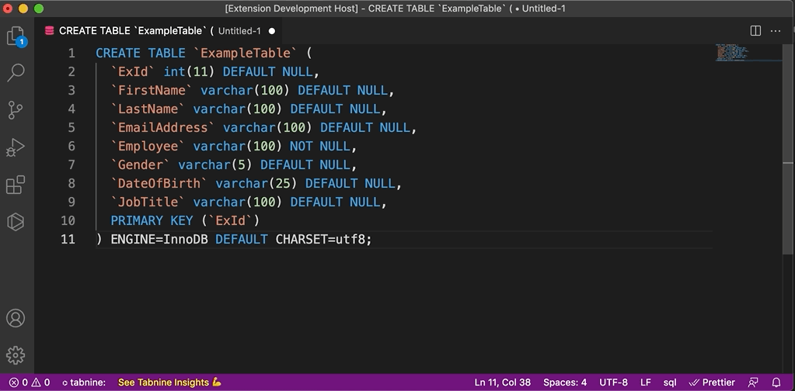

# Single Quote Wrapper README

This extension wraps every line with single quotes.

My usecase was: I needed to add mysql queries to a python application. When I copied the 'create table syntax', I either had to manually add single quotes to remain the format or manually format it to a single line.
This is a quick and simple way to remain (most of) the format.

## Features
Open the command pallete (Command + shift + p on Mac or ctrl + shift + p on Windows or View->Command Palette) and type:
* `Single quote all the lines`

The extensions takes the selected text,
splits it up at every line break and returns a list of lines which are wrapped in single quotes, have the beginning trimmed and a whitespace and linebreak added at the end of the line.

## Release Notes

Users appreciate release notes as you update your extension.

### 1.0.0

Initial release of the extension.

-----------------------------------------------------------------------------------------------------------